# ST0256 Tópicos Especiales en Telemática

## Estudiante:
- Nombre: Juan Esteban Avendaño Castaño
- Correo: jeavendanc@eafit.edu.co

## Profesor:
- Nombre: Álvaro Ospina
- Correo: aeospinas@eafit.edu.co

# Proyecto 3 - Spark con Notebooks y PySpark
Este proyecto se enfoca en el uso de Spark con Notebooks y PySpark.
Se hará uso de Google Colab para ejecutar PySpark.

En dataset que se usará es el de [Casos positivos de COVID 19](https://www.datos.gov.co/api/views/gt2j-8ykr/rows.csv?accessType=DOWNLOAD) en Colombia.

## 1 Subir datos Google Drive
Primero se sube el archivo `Casos_positivos_de_COVID-19_en_Colombia.csv` a Google Drive. Este archivo contiene los datos de los casos positivos de COVID-19 en Colombia.

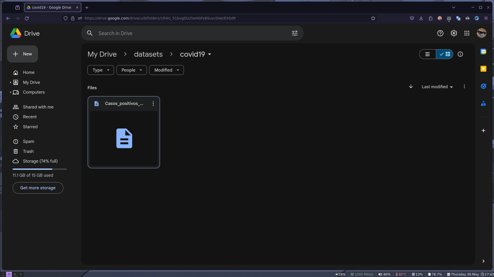

## 2 Análisis de exploratorio de los datos
### 2.1 Listar columnas
Se listan las columnas del dataset de la siguiente manera:
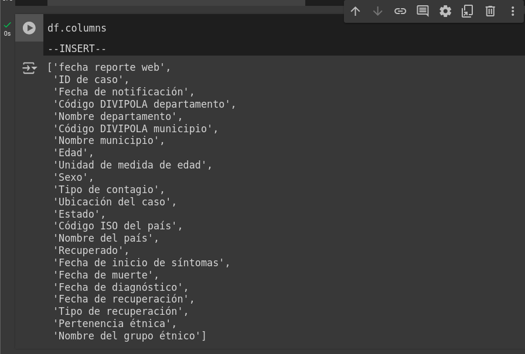

### 2.2 Tipos de datos
Se muestran los tipos de datos de las columnas del dataset de la siguiente manera:
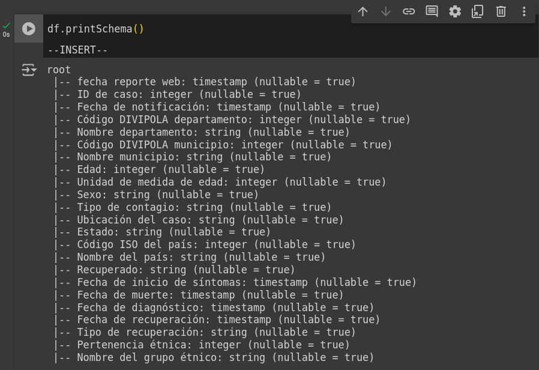

### 2.3 Seleccionar algunas columnas
Se seleccionan algunas columnas del dataset de la siguiente manera:
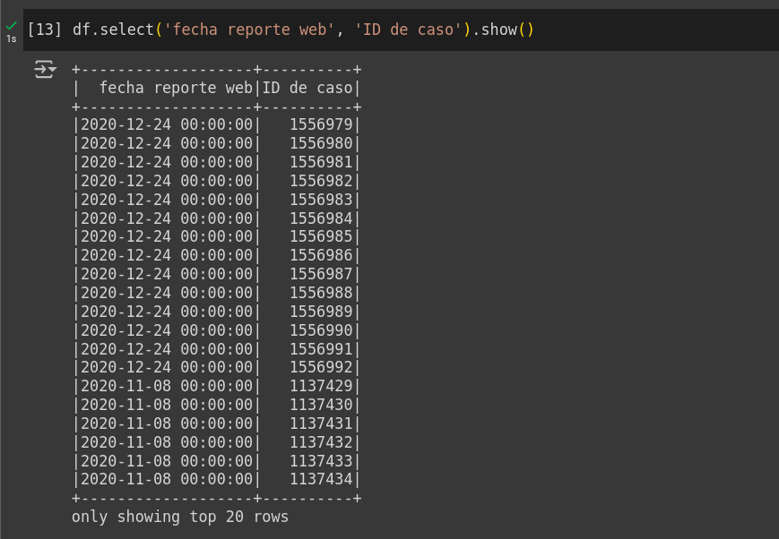

### 2.4 Renombrar columnas
Se renombran las columnas sin espacios en blanco y sin mayúsculas de la siguiente
manera:
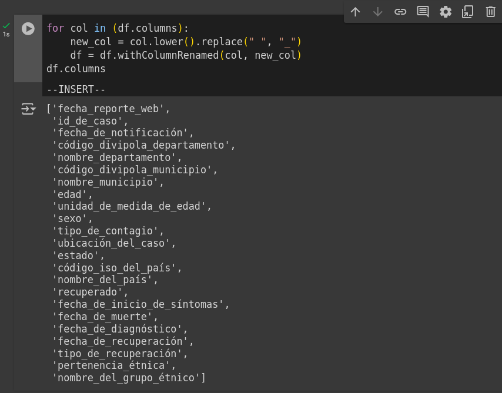

### 2.5 Agregar columna
Agregamos una columna al dataset. En este caso agregamos una columna con el tiempo
de recuperación de los pacientes:
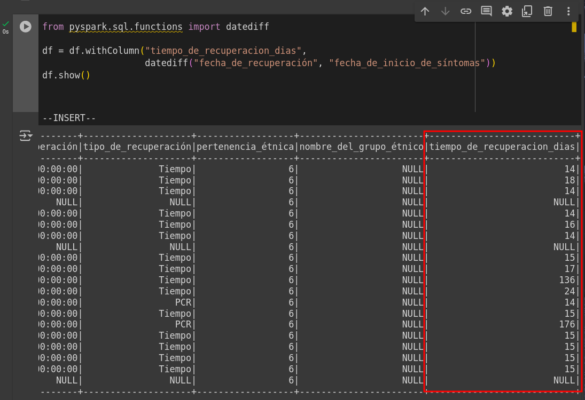

### 2.6 Borrar columnas
Borramos la columna que acabamos de agregar al dataset:
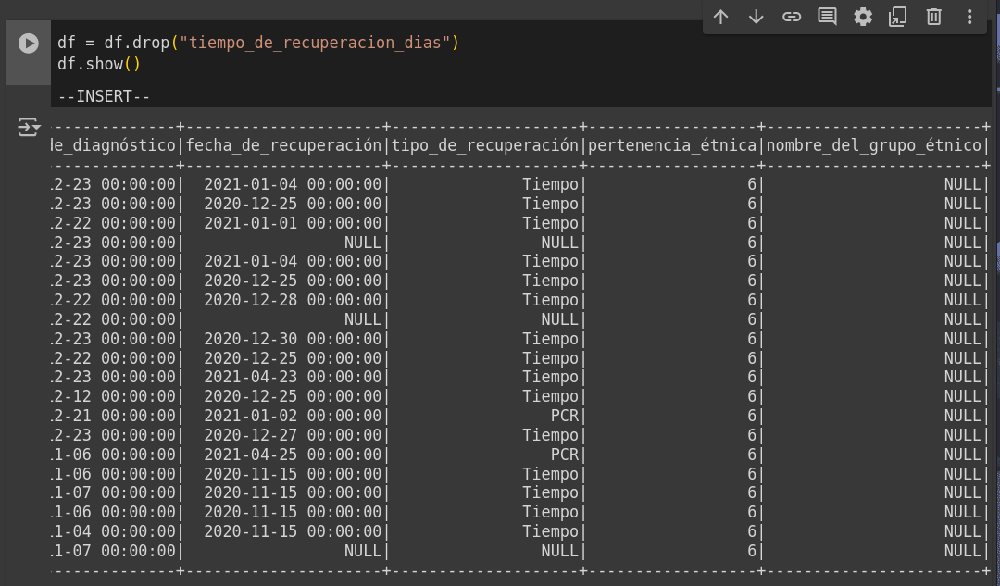

### 2.7 Filtrar datos
Filtramos los datos del dataset. En este caso filtramos los datos de los pacientes
que tienen más de 60 años:
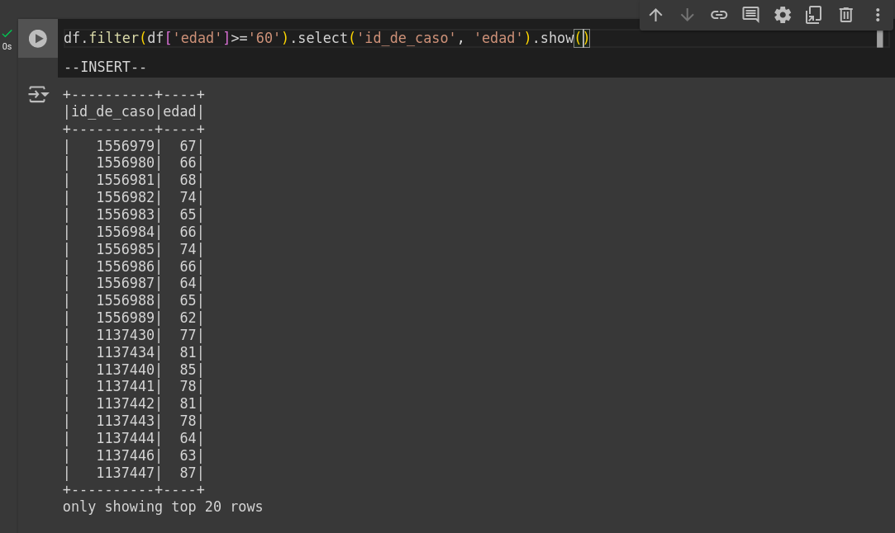

### 2.8 Ejecutar una función UDF creando una nueva columna
Se crea una función UDF que categoriza a los pacientes según su edad:
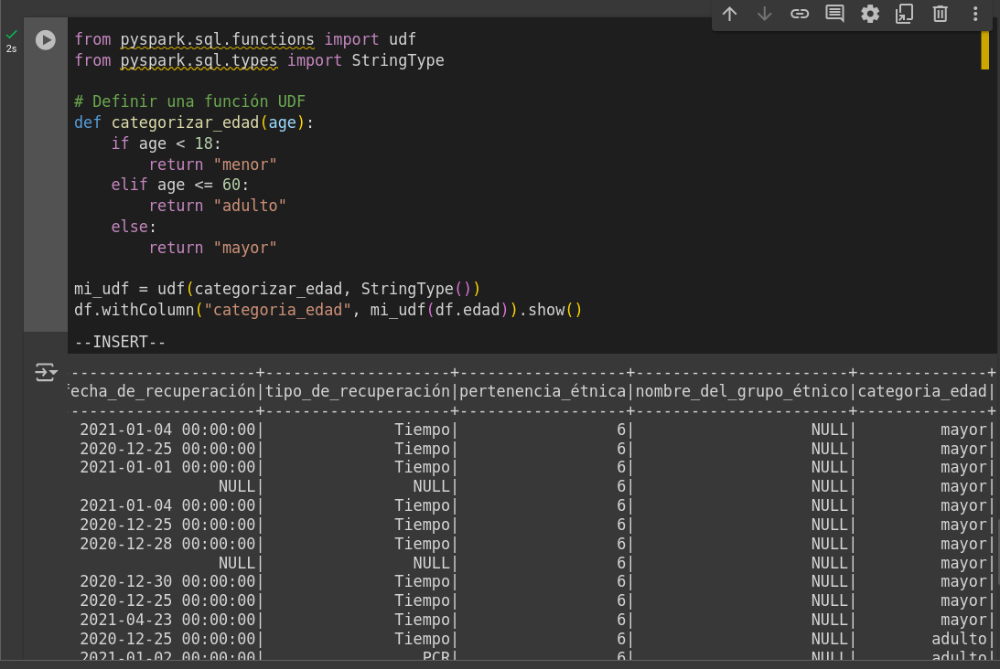

## 3 Preguntas de negocio
Realizamos las preguntas y guardamos los resultados en csv para guardarlo en S3.

### 3.1 Los 10 departamentos con más casos de COVID-19 ordenados de mayor a menor
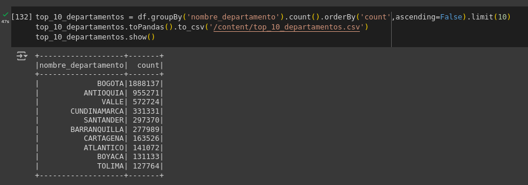

### 3.2 Las 10 ciudades con más casos de COVID-19 ordenadas de mayor a menor
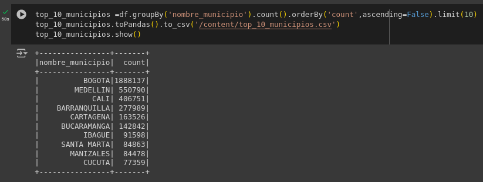

### 3.3 Los 10 días con más casos de COVID-19 ordenados de mayor a menor
Lista de los 10 días con más casos de COVID-19 ordenados de mayor a menor
en base a las fechas de diagnóstico, ya que en el diagnóstico se confirma
si el paciente tiene COVID-19:
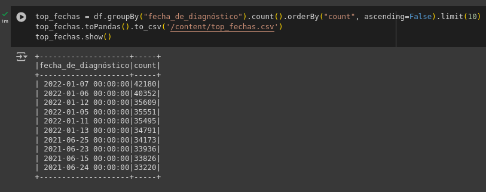

### 3.4 Distribución de casos de COVID-19 por edades en Colombia
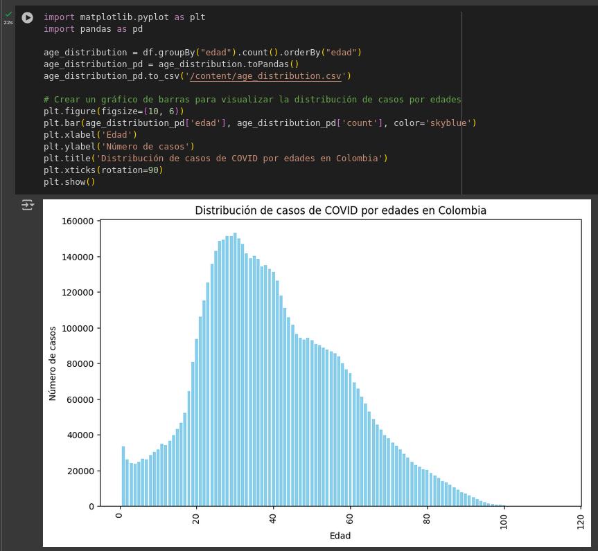

### 3.5 Distribución de casos de COVID-19 por departamentos en Colombia
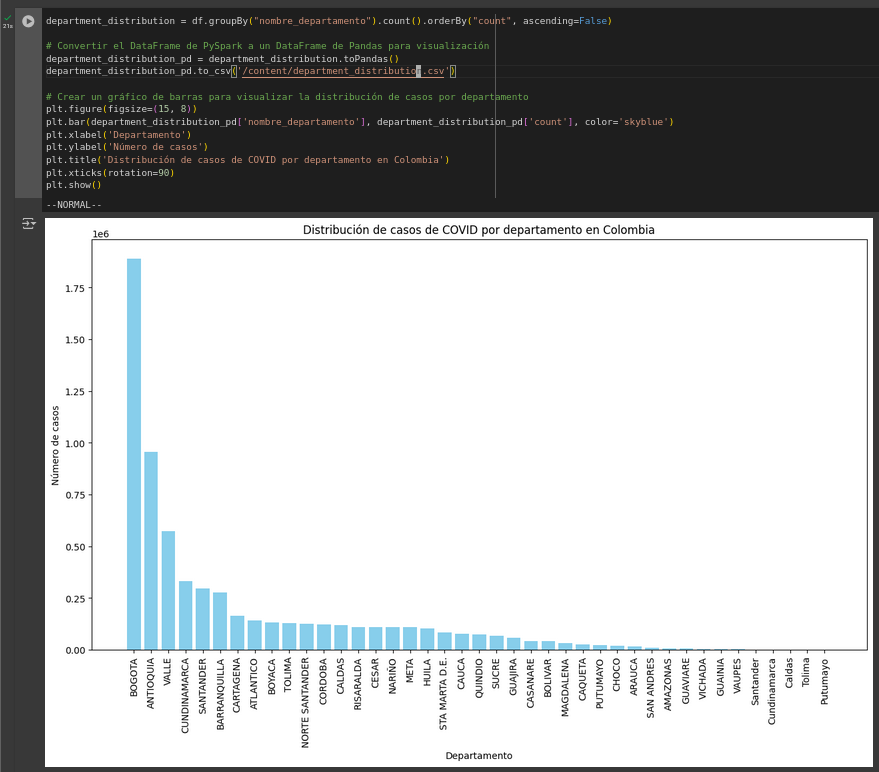

## 4 Subir archivos a Amazon S3
Primero listamos los archivos en el directorio actual para verificar que se crearon los archivos CSV con los resultados de las preguntas de negocio:
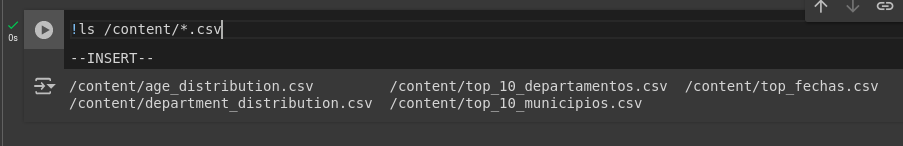

Creamos la carpeta `proyecto-3` en S3:
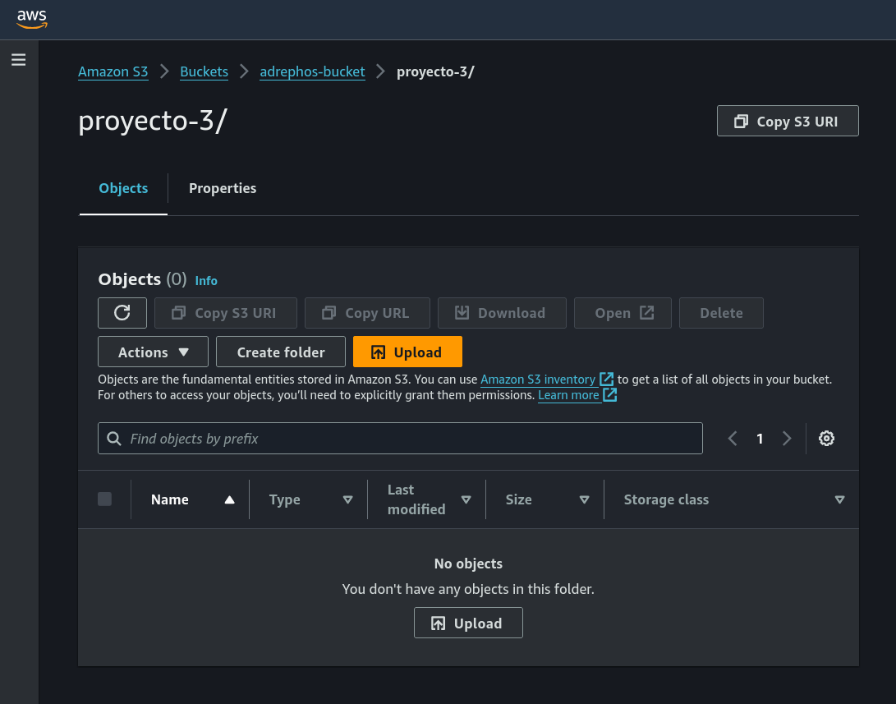

Instalamos boto3 para poder subir los archivos a Amazon S3:
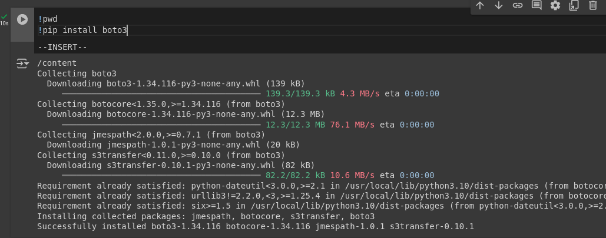

Creamos el objeto de conexión a S3:
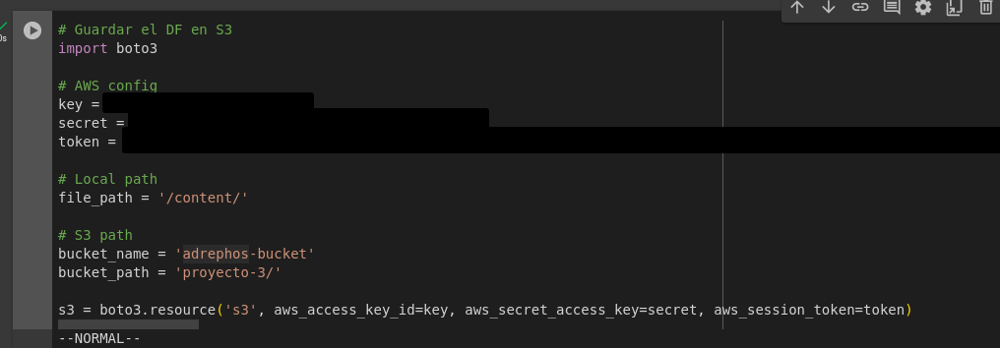

Subimos los archivos CSV a S3:

Verificamos que los archivos se hayan subido correctamente a S3:
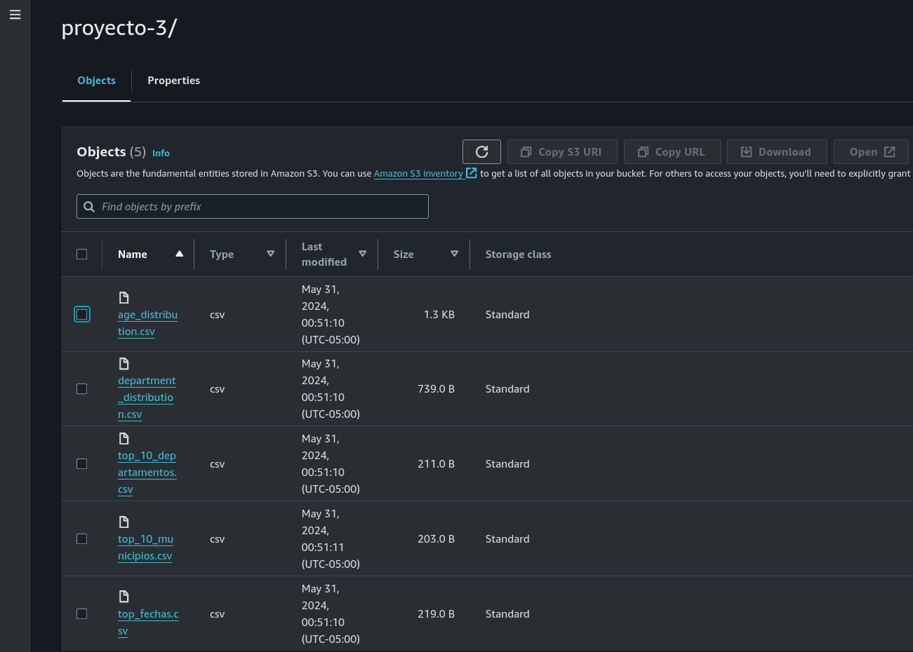

## 5 Video
El video del proyecto se encuentra en el siguiente enlace:

## 6 Conclusiones
- Se realizó un análisis exploratorio de los datos de los casos positivos de COVID-19 en Colombia.
- Se respondieron preguntas de negocio sobre los casos de COVID-19 en Colombia.
- Se subieron los archivos CSV con los resultados de las preguntas de negocio a Amazon S3.
- Se logró 100% de ejecución de las celdas de PySpark en Google Colab.
